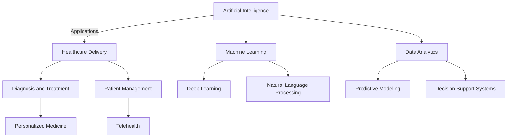
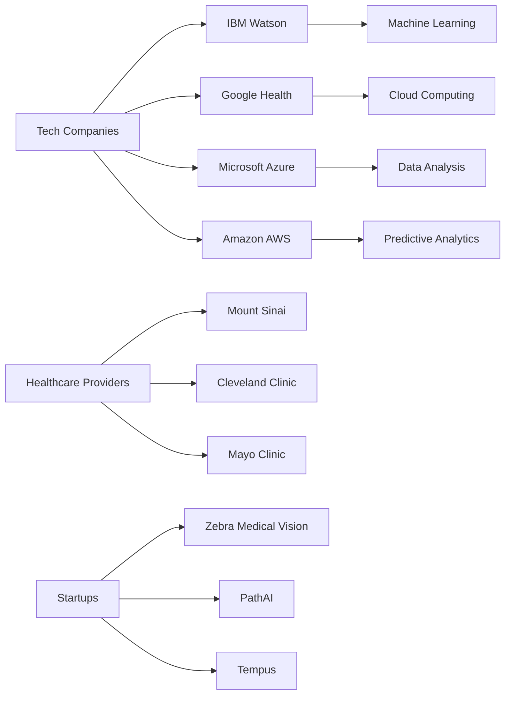
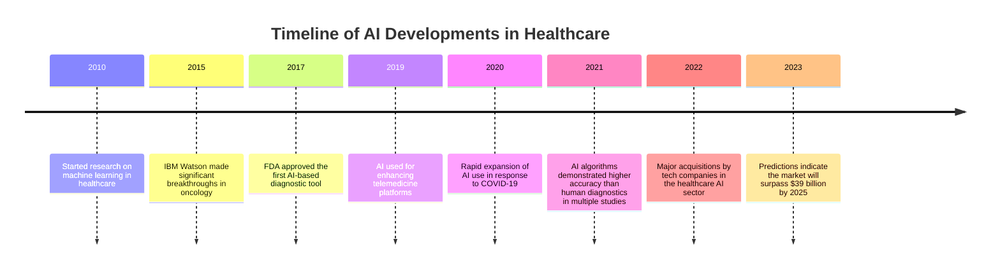
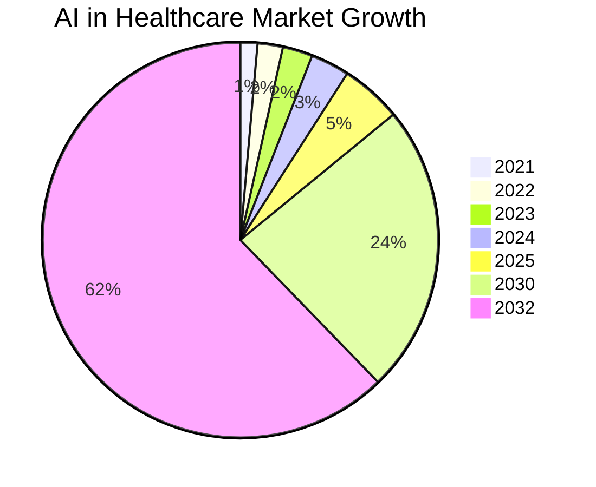

# AI in Healthcare Report

## Executive Summary
Artificial Intelligence (AI) is revolutionizing healthcare by improving patient outcomes, optimizing operational efficiency, and enabling personalized medicine. This report explores the latest developments, key players, market analysis, potential challenges, and future outlook of AI in healthcare.

## Detailed Analysis
### 1. Introduction to AI in Healthcare
AI technologies, including machine learning and data analytics, are increasingly being applied to enhance healthcare services. Major applications include automated diagnostics, patient management, telehealth, and predictive modeling.

### 2. Key Developments
- **2010:** Research on machine learning initiated.
- **2015:** IBM Watson achieved significant breakthroughs in oncology.
- **2017:** FDA approved the first AI-based diagnostic tool.
- **2019:** AI integration with telemedicine expanded.
- **2020:** Surge in AI usage during the COVID-19 pandemic.
- **2021:** AI algorithms outperformed human diagnostics in various studies.
- **2022:** Major tech-acquisitions in healthcare AI.
- **2023:** Predictions suggest the AI healthcare market will exceed $39 billion by 2025.

### 3. Key Players
- **Tech Companies:** IBM Watson, Google Health, Microsoft Azure, Amazon AWS.
- **Healthcare Providers:** Mount Sinai, Cleveland Clinic, Mayo Clinic.
- **Startups:** Zebra Medical Vision, PathAI, Tempus.

## Visual Elements
### 1. Mermaid Diagram Showing the Relationship Between Key Concepts

### 2. Relationship Graph of Key Players and Technologies

### 3. Timeline of Developments in AI Healthcare

### 4. Visualization of Market Trends and Predictions

## Citations and References
- Grand View Research. (2023). [AI In Healthcare Market Size, Share & Growth Report, 2030](https://www.grandviewresearch.com/industry-analysis/artificial-intelligence-ai-healthcare-market)
- NCBI. (2023). [Artificial intelligence in healthcare: transforming the practice of medicine](https://pmc.ncbi.nlm.nih.gov/articles/PMC8285156/)
- MarketsandMarkets. (2023). [Artificial Intelligence (AI) in Healthcare Market Growth Report](https://www.marketsandmarkets.com/Market-Reports/artificial-intelligence-healthcare-market-54679303.html)
- Business Wire. (2023). [Global Artificial Intelligence in Healthcare Research Report 2023](https://www.businesswire.com/news/home/20231117222966/en/Global-Artificial-Intelligence-in-Healthcare-Research-Report-2023---ResearchAndMarkets.com)

## Future Outlook
The future of AI in healthcare is promising, with expected continued growth in applications across various subfields. Challenges such as data privacy, regulatory compliance, and integration with existing systems remain, but ongoing research and investment from both public and private sectors are likely to overcome these hurdles, fostering innovation and improved healthcare outcomes.