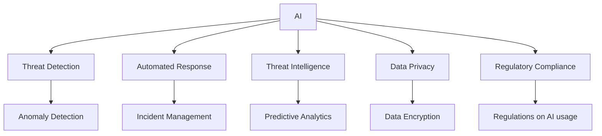
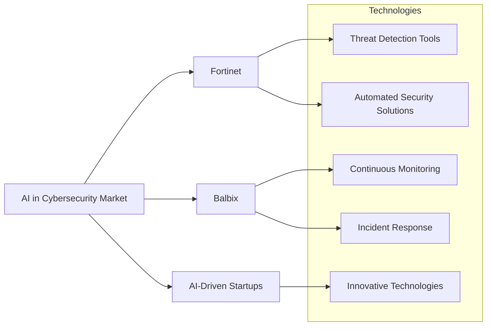
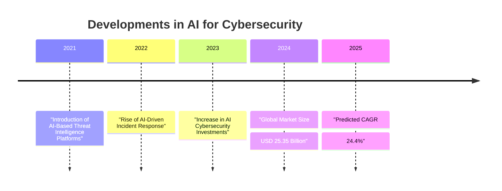
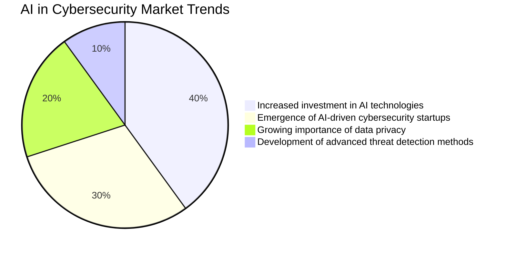

# AI in Cybersecurity: Comprehensive Report

## 1. Executive Summary
The integration of Artificial Intelligence (AI) in cybersecurity has become vital as organizations face increasing cyber threats. AI systems enhance the capabilities of cybersecurity practitioners by automating tasks, predicting potential threats, and enabling faster responses. Recent developments indicate that the global AI cybersecurity market is projected to grow from USD 25.35 billion in 2024 to a compound annual growth rate (CAGR) of 24.4% by 2030. With increasing investments and advancements in technology, AI is poised to reshape the cybersecurity landscape.

## 2. Detailed Analysis

### 2.1 Latest Developments and Trends
Recent studies illustrate how AI can affect various aspects of cybersecurity:
- **Automated Defense Mechanisms:** AI technologies provide automated threat detection and response, allowing organizations to respond to incidents swiftly. 
- **Threat Intelligence Utilization:** Using AI, companies can gain valuable insights from vast data sets, enhancing their ability to predict and mitigate cyber threats.
- **Literature Review Insights:** A systematic literature review of AI in cybersecurity demonstrates several practical applications and highlights future directions.

**Key Resources:**
- [The impact of artificial intelligence on organizational cyber security](https://www.sciencedirect.com/science/article/pii/S2543925123000372)
- [Artificial intelligence for cybersecurity: Literature review and future directions](https://www.sciencedirect.com/science/article/pii/S1566253523001136)
- [Current trends in AI and ML for cybersecurity](https://www.tandfonline.com/doi/full/10.1080/23311916.2023.2272358)

### 2.2 Key Players and Technologies
The AI in cybersecurity sector comprises various key players, including established companies and innovative startups:
- **Market Overview:** The market was estimated at USD 25.35 billion, with significant contributions to enhanced threat detection and response capabilities.
- **Player Highlights:**
  - **Fortinet:** Known for its automated security solutions.
  - **Balbix:** Focuses on continuous monitoring and incident response.
  - **AI-Driven Startups:** Emerging technologies are continually introducing new capabilities.
  
**Key Resource:**
- [AI In Cybersecurity Market Size, Share | Industry Report, 2030](https://www.grandviewresearch.com/industry-analysis/artificial-intelligence-cybersecurity-market-report)

### 2.3 Market Analysis and Future Predictions
- **Market Size & Growth:** Expected rise in the AI cybersecurity market with increased investments in AI technologies.
- **Trends:** Emergence of AI-driven startups and a strong trend towards data privacy and regulatory compliance.

### 2.4 Potential Challenges and Solutions
- **Data Privacy Concerns:** Stricter regulations on data use can mitigate risks.
- **Adversarial Attacks on AI Systems:** Developing robust machine learning models is essential to withstand attacks.

## 3. Visual Elements
### 3.1 Mermaid Diagram: Key Concepts in AI for Cybersecurity

### 3.2 Relationship Graph: Key Players and Technologies

### 3.3 Timeline of Developments in AI and Cybersecurity

### 3.4 Market Trends and Predictions

## 4. Citations and References
1. [Enhancing Cybersecurity through AI and ML: Strategies, Challenges](https://www.scirp.org/journal/paperinformation?paperid=134347)
2. [The future of Artificial Intelligence in Cybersecurity](https://www.researchgate.net/publication/353046785_The_future_of_Artificial_Intelligence_in_Cybersecurity_A_Comprehensive_Survey)

## 5. Future Outlook
The future of AI in cybersecurity looks promising with technological advancements continuously evolving. Organizations need to navigate the challenges while leveraging AI's potential to enhance their cybersecurity posture. As AI technology matures, it will play an increasingly critical role in detecting, responding to, and mitigating cyber threats effectively.